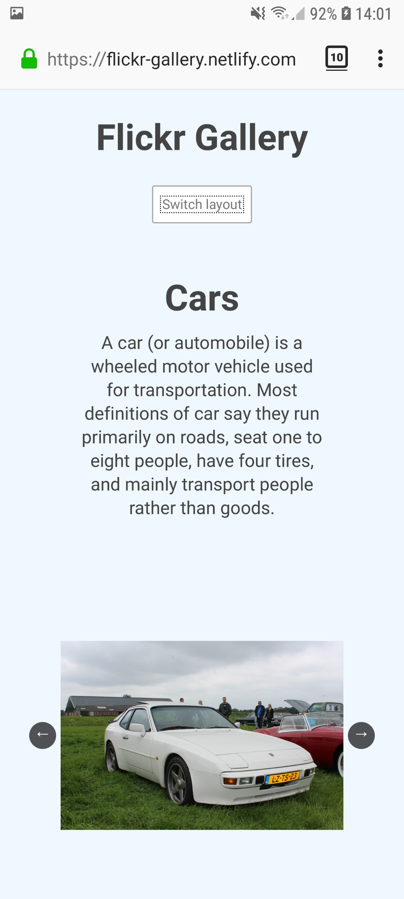
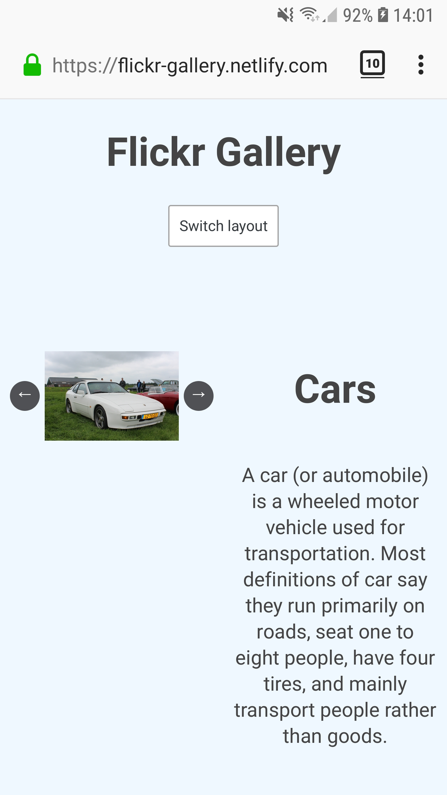

# Flickr Gallery
The most recent version of this page can be found [here](http://flickr-gallery.netlify.com).

## Built with
  * VanillaJS
  * Flickr API
  * Promise poly-fill
  * Fetch API

## Setup
To get it up and running open a terminal in the root folder and run:

``` shell
npm start
```

# Images
Following this is how the webpage looks in different browsers on a monitor in portrait mode.
To see how the webpage looks using your setup click [here](http://flickr-gallery.netlify.com).

## IE11


## Firefox


## Chrome


## Firefox Android app


